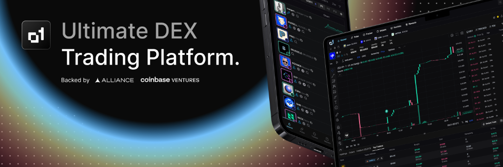

# o1.exchange Brand Kit

This repo contains **brand** and **editorial style** guides for o1.exchange.

o1.exchange is the next-generation trading platform built for the DeFi ecosystem, combining institutional-grade infrastructure with an intuitive user experience for traders of all levels.

## Fonts

- **Primary**: Poppins
- **Secondary**: Monument Extended

## Brand Colors

| Color | Hex | Use Case |
|-------|-----|----------|
| **Blue (Primary)** | `#9CD6FF` | Primary Brand Color |
| **White** | `#FFFFFF` | Text, Icons |
| **Black** | `#1A1A1A` | Backgrounds |

Welcome to the o1.exchange Brand Kit. This repository contains the official logos, assets, and guidelines for the o1.exchange brand.

## Contents

- **[Guidelines](guidelines/)**: detailed editorial style guide for using our brand assets.
- **[Logos](logo/)**:
  - **[PNG](logo/png/)**: Raster format logos suitable for web and digital use.
  - **[SVG](logo/svg/)**: Vector format logos suitable for print and high-resolution applications.

## Usage

Please refer to the [Editorial Style Guide](guidelines/Editorial%20Style%20Guide.md) for instructions on how to correctly use our brand assets.

## Ownership

All assets in this repository are property of o1.exchange.
